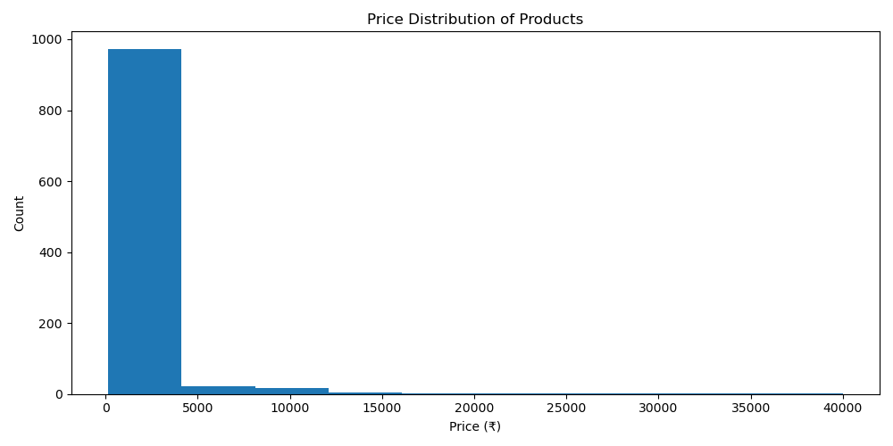
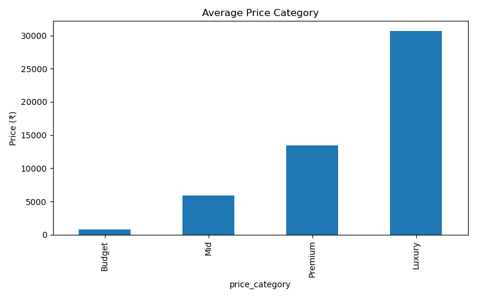
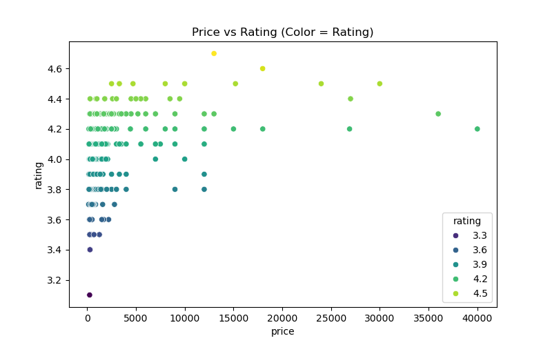
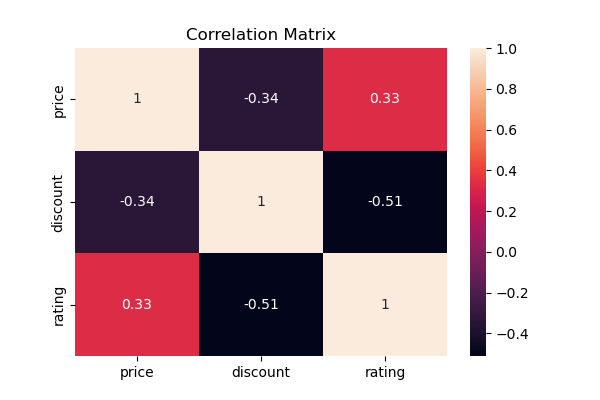

# 📊 E-Commerce Product Price & Rating Analysis (Flipkart)

## 📌 Project Overview
This project performs an end-to-end analysis of e-commerce product data to understand pricing patterns, discount strategies, and their impact on customer ratings. The goal is to extract actionable business insights using real-world, messy data and present them through clean visualizations.

The project simulates a real industry analytics workflow, from data collection to insight generation.

---

## 🛠️ Tools & Technologies Used
- **Python**
- **Pandas & NumPy** – Data cleaning and manipulation
- **Matplotlib & Seaborn** – Data visualization
- **BeautifulSoup** – Web scraping (static HTML)
- **Jupyter Notebook**

---

## 📂 Project Structure
├── Data/
│ └── flipkart_cleaned_data.xlsx
│
├── Visuals/
│ ├── Average_Price_Category.png
│ ├── Correlation_Matrix.png
│ ├── Discount_vs_Rating.png
│ ├── Price_Distribution_of_Products.png
│ └── Price_vs_rating.png
│
├── Notebooks/
│ └── Scraper.ipynb

---

## 🔍 Key Analysis Performed
- Price distribution analysis across products
- Price segmentation into Budget, Mid, Premium, and Luxury categories
- Impact of discounts on customer ratings
- Correlation analysis between price, discount, and ratings
- Visual storytelling using professional charts and plots

---

## 📈 Key Insights
- Most products fall into the **budget and mid-price range**, indicating a price-sensitive market.
- **Higher discounts do not guarantee higher ratings**; excessive discounting may be associated with lower customer satisfaction.
- Product price shows only a **weak positive correlation** with ratings, suggesting perceived value is not solely price-driven.
- Customer ratings remain relatively consistent across price segments.

---

## ⚠️ Limitations
- Seller information was excluded due to inconsistent availability and JavaScript-based rendering on product pages.
- Analysis is based on listing-level data and does not include detailed product specifications.

---

## 📊 Visual Analysis & Insights

### 🔹 Price Distribution of Products

**Insight:**  
Most products are priced in the lower range, indicating a market focused on budget and mid-range consumers with few premium outliers.

---

### 🔹 Average Price by Category

**Insight:**  
Products are clearly segmented into Budget, Mid, Premium, and Luxury categories, showing a structured pricing strategy.

---

### 🔹 Price vs Rating

**Insight:**  
Higher-priced products do not always receive better ratings, suggesting customer satisfaction is not strictly price-dependent.

---

### 🔹 Discount vs Rating

**Insight:**  
High discounts do not guarantee higher ratings. Excessive discounting may be associated with lower perceived quality.

---

### 🔹 Correlation Matrix

**Insight:**  
- Price and rating show a weak positive correlation  
- Discount and rating show a moderate negative correlation  
- Aggressive discounts may negatively impact customer satisfaction  

---

## 📈 Key Insights Summary
- Most products fall into the **budget and mid-price range**
- **Higher discounts do not ensure higher ratings**
- Price has only a **weak influence on customer satisfaction**
- Ratings remain relatively consistent across price categories

---

## ⚠️ Limitations
- Seller information was excluded due to inconsistent availability and JavaScript-based rendering on product pages
- Analysis is based on listing-level data only

---

## 🎯 Conclusion
This project demonstrates practical skills in data scraping, cleaning, exploratory data analysis, and visualization. It highlights the ability to convert raw e-commerce data into meaningful insights that support data-driven decision-making.

---

## 🚀 Future Improvements
- Include review count analysis
- Time-based price tracking
- Category-level comparisons
- Interactive da

## 🎯 Conclusion
This project demonstrates practical skills in data scraping, cleaning, exploratory data analysis, and visualization. It focuses on converting raw e-commerce data into meaningful insights that can support data-driven business decisions.

---

## 🚀 Future Improvements
- Include review count analysis
- Time-based price tracking
- Category-level comparison
- Dashboard creation using Streamlit or Power BI

---

## 👤 Author
**AbdulRehman Shaikh**  
Aspiring Data Analyst | Python | Pandas | Data Visualization
